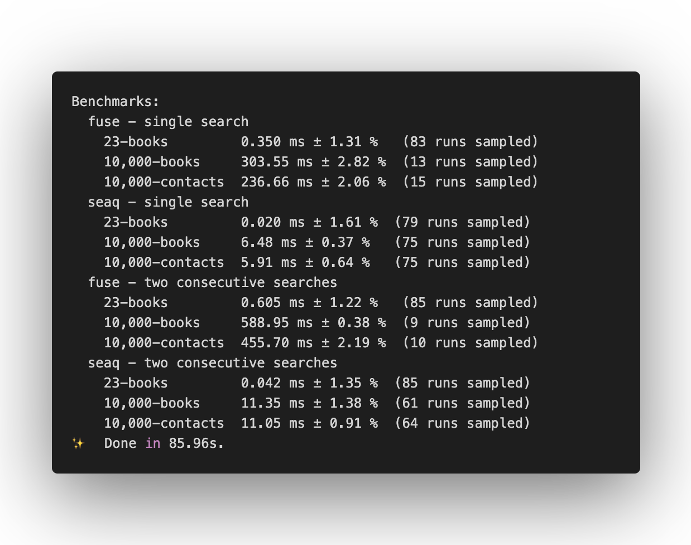

# Seaq - Real nice ES6 fuzzy string search

Seaq is an ES6 string search library heavily inspired by [Fuse.js](https://github.com/krisk/fuse). It is built in [Typescript](https://github.com/Microsoft/TypeScript) implementing the fantastic [string_score](https://github.com/joshaven/string_score) string matching algorithm.

| Statements                                                                  | Branches                                                                  | Functions                                                                  | Lines                                                                  |
| --------------------------------------------------------------------------- | ------------------------------------------------------------------------- | -------------------------------------------------------------------------- | ---------------------------------------------------------------------- |
|  |  |  |  |

## Basic usage

```typescript
import { seaq } from 'seaq';

const contacts = [ { name: 'John', ... }, { name: 'Jane', ... }];
const queryString = 'jo';

const orderedContacts = seaq(contacts, queryString, ['name']);
```

## API

```typescript
/**
 * Given an input list Array<T>, a set of object keys to search, and a search
 * query, Seaq will return a new Array<T> containing the results ordered by
 * their Score which is calculated using a variation of string_score algorithm.
 *
 * @export
 * @template T generic
 * @param {Array<T>} list list of objects or strings to search
 * @param {string} query query string to match against keys in objects
 * @param {(Array<Extract<keyof T, string>> | string[])} keys optional keys to search in the object
 * @param {number} [fuzzy] optional fuzziness should be between 0 and 1. low fuzziness like 0.01 means a mismatch will drop the score more then a fuzziness of something like 0.9.
 * @returns {Array<T>}
 */
export function seaq<T>(
  list: Array<T>,
  query: string,
  keys?: Array<Extract<keyof T, string>> | string[],
  fuzzy?: number,
): Array<T>;
```

## Performance

Running `yarn benchmark` yields the follow results comparing `seaq` to [`Fuse.js`](https://github.com/krisk/Fuse)

Granted this is not an apples to apples comparison because `Fuse.js` and `seaq` provide very different results. `seaq` has fewer configuration options and may not be flexible enough for some use-cases. But generally, if performance is your primary concern, `seaq` may be the right tool for the job.
